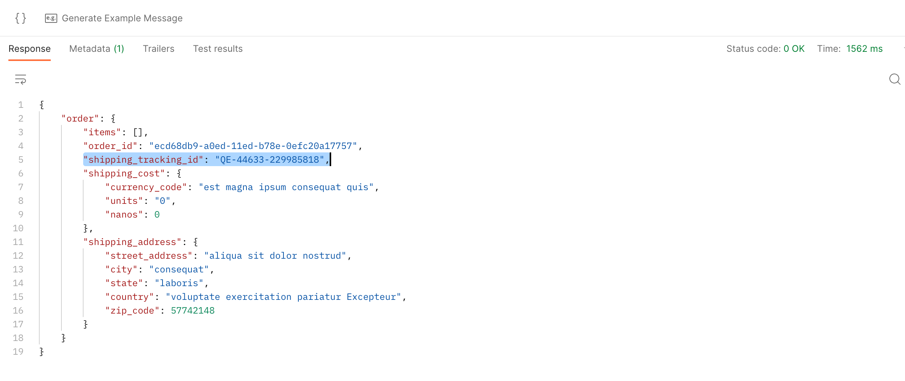
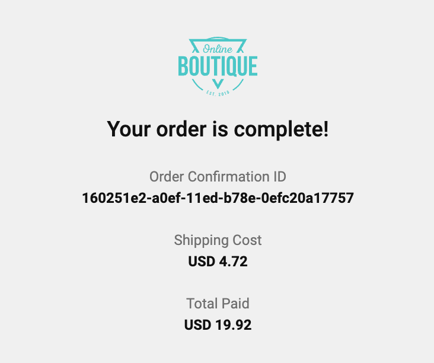
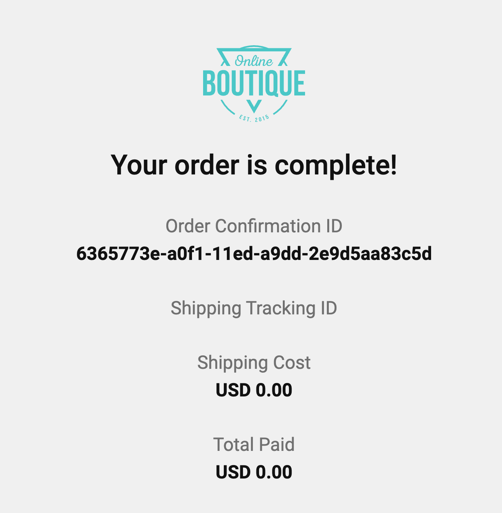
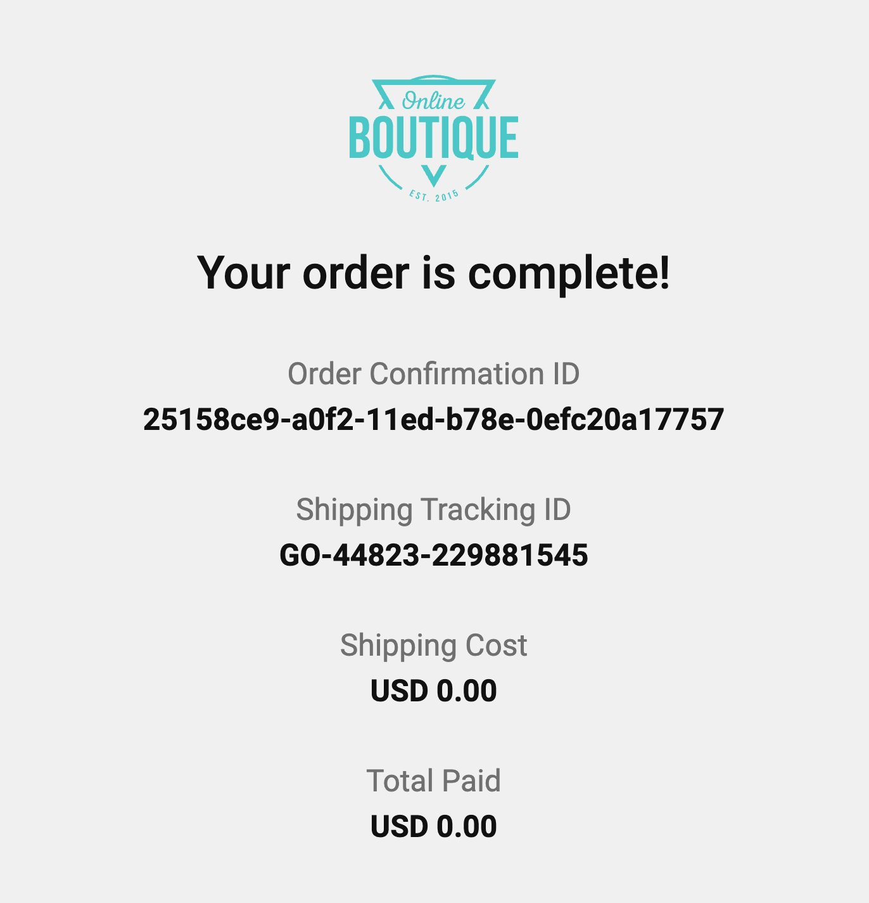

# **Feature Testing with Signadot Sandboxes**

In this guide you’ll learn how to test a new feature that impacts multiple microservices using Signadot Sandboxes. We’ll use this fork of the[ Online Boutique](https://github.com/signadot/microservices-demo) microservices demo app to demonstrate the workflow, which can be automated using Signadot’s[ GitHub integration](https://docs.signadot.com/docs/github-ci-integration).

We’ll add a new feature to the[ checkout service](https://github.com/signadot/microservices-demo/tree/main/src/checkoutservice): new orders will contain a shipping tracking number. We’ll also add a field in the[ frontend service](https://github.com/signadot/microservices-demo/tree/main/src/frontend) to display this tracking information to the user. Using[ Sandboxes](https://docs.signadot.com/docs/concepts/sandbox/), you’ll be able to test these features independently using your existing baseline staging environment and running staging services. Using a[ RouteGroup](https://docs.signadot.com/docs/routegroup-spec), you’ll be able to test the feature end-to-end, while still using your baseline staging environment.

By the end of this guide, you’ll have done the following:

* Deployed the microservices demo app into your cluster
* Added a new feature to the microservices app’s checkout service, and tested it using a lightweight Sandbox
* Added a new feature to the frontend service, and tested it using a Sandbox
* Created a RouteGroup to test the new feature end-to-end, across both Sandboxes

## Prerequisites

Before you begin, you should have the following available to you:

* A Kubernetes (K8s) cluster
    * You can also use a local cluster like[ kind](https://kind.sigs.k8s.io/) or[ minikube](https://minikube.sigs.k8s.io/docs/start/)
    * Your cluster should have at least the following:
        * 4 CPUs
        * 4.0 GiB memory
        * 32 GB disk space
* [kubectl](https://kubernetes.io/docs/tasks/tools/#kubectl), configured to access your K8s cluster
* [Docker Desktop](https://www.docker.com/products/docker-desktop/), logged in and configured to access a Docker repository
* [Skaffold](https://skaffold.dev/docs/install/)
* [Helm](https://helm.sh/)
* A Signadot account. To create one, navigate to [signadot.com](https://www.signadot.com/) and click **Get Started**

## Step 1: Set up Signadot

To begin, we’ll install the Signadot Operator into our cluster and install the Signadot CLI on our local machine.

The Signadot Operator maintains a connection with the Signadot control plane / backend and manages workloads in your K8s cluster, like Sandboxes and their associated resources. It also manages routing for requests between services. To learn more about the Operator and its functions, please see[ Signadot Operator](https://docs.signadot.com/docs/signadot-architecture-operator).

From the [Signadot Dashboard](https://app.signadot.com/) navigate to **Clusters** and then **Connect Cluster.** Supply a cluster name that identifies the cluster you are using. The onboarding UI will present you with the following installation instructions that you can copy and paste (be sure to replace `<cluster-token>` with the provided cluster token):

```bash
kubectl create ns signadot
kubectl -n signadot create secret generic cluster-agent --from-literal=token='<cluster-token>'
helm repo add signadot https://charts.signadot.com
helm install signadot-operator signadot/operator
```

To learn more about this step, please see[ Install the Signadot Operator.](https://docs.signadot.com/docs/installation#install-the-signadot-operator) With the Operator up and running in our cluster, we’ll now install the Signadot CLI on our local machine.

Download and extract the latest[ release](https://github.com/signadot/cli/releases). You can also use the Homebrew package manager:

```bash
brew tap signadot/tap
brew install signadot-cli
```

To learn more about installing the Signadot CLI, please see the[ CLI docs](https://docs.signadot.com/docs/cli/#installation).

Configure the CLI by creating a file at `$HOME/.signadot/config.yaml`.

The file should contain the following:

```bash
org: <YOUR_ORG_NAME>
api_key: <YOUR_API_KEY>
```

You can create an API key by navigating to the[ Signadot dashboard](https://app.signadot.com/settings/apikeys).

Test that everything is working:

```bash
$ signadot cluster list

NAME            CREATED                OPERATOR VERSION
your-cluster    2023-01-26T18:47:35Z   0.11.1
```

With the Operator and CLI ready to go, we’ll deploy the microservices demo app as our baseline environment.

## Step 2: Deploy Microservices Demo App

In this step you’ll deploy a forked version of Google’s[ Online Boutique](https://github.com/GoogleCloudPlatform/microservices-demo) microservices demo app. Online Boutique is an 11-tier e-commerce app that consists of various microservices, like a frontend service, a checkout service, a recommendation service, and more. In this guide we’ll modify `checkoutservice` and `frontend` to display a shipping tracking number to the user (note the original app has this feature, but we’ve removed it in this fork to demonstrate the workflow in this guide):

* `checkoutservice` will return a shipping tracking ID to `frontend`
* `frontend` will extract this tracking ID and display it to the user

Begin by cloning the[ demo app](https://github.com/signadot/microservices-demo) (ensure you clone the fork, and not the app in the Google repo):

```bash
$ git clone git@github.com:signadot/microservices-demo.git
$ cd microservices-demo
```

The manifests in `kubernetes-manifests` are ready to deploy. These contain the “baseline” version of our app which will simulate a running staging environment. Usually this will be the version corresponding to the `main` or `master` branch (or `staging`, depending on your org’s workflow).

Deploy the app to your cluster:

```bash
$ kubectl apply -f kubernetes-manifests
```

Wait approximately 2-3 minutes for the app to stabilize. You should see the following running Pods:

```bash
$ kubectl get pod

NAME                                    READY   STATUS    RESTARTS   AGE
adservice-5d5d6f6b9c-7pqwg              2/2     Running   0          49s
cartservice-7696945665-7mm7k            2/2     Running   0          49s
checkoutservice-d9bbd7878-hv5gd         2/2     Running   0          48s
currencyservice-7f775c7885-w8mk2        2/2     Running   0          48s
emailservice-6675d4679b-2f8wq           2/2     Running   0          48s
frontend-c5cb967fc-wpmhf                2/2     Running   0          47s
paymentservice-5784d6d849-m7rdf         2/2     Running   0          47s
productcatalogservice-8879f8866-cx7wp   2/2     Running   0          47s
recommendationservice-555d5fcbf-mjlf9   2/2     Running   0          46s
redis-cart-5d45978b94-z56zs             1/1     Running   0          46s
shippingservice-b98d4848c-7hr7t         2/2     Running   0          46s
```

> **Note**: Each Pod contains two running containers: the Signadot Operator automatically creates sidecar containers to proxy requests to the appropriate sandboxes. Annotations on workloads instruct Signadot on which workloads to proxy and how to proxy requests. To learn more, please see [Request Routing](https://docs.signadot.com/docs/request-routing/) and [an example](https://github.com/signadot/microservices-demo/blob/main/kubernetes-manifests/adservice.yaml#L14) in this Github repo.

You can then navigate to the app’s frontend using `kubectl port-forward`:

```bash
$ kubectl port-forward svc/frontend 8080:80
```

Visit[ http://localhost:8080](http://localhost:8080) and you should see the app’s landing page:


With our e-commerce app up and running, we’re ready to PR our first change to the checkout backend service.

## Step 3: Add Checkout Service Feature

In this step we’ll add the new feature to the checkout service, and test it in a Sandbox. The Sandbox will contain the modified version of the checkout service, and requests will be routed through existing “baseline” versions of other services. A request to the Sandbox will flow through the already running frontend service, onto the modified checkout service, and to any other running baseline microservices. To learn more about how this works, please see [request routing](https://docs.signadot.com/docs/request-routing).

To begin, let’s create a new git branch and make the the change in the branch:

```bash
$ git switch -c feat-x-checkoutsvc
```

Next, we’ll make the code change. Using your favorite editor, open the file `src/checkoutservice/main.go`. Make the following changes:

```go
. . . (line 261)
// Ship Order
shippingTrackingID, err := cs.shipOrder(ctx, req.Address, prep.cartItems)
. . .
```

Instead of discarding the return value using `_` , we save it. Be sure to use the short variable declaration operator `:=`.

Next, add the `ShippingTrackingId` field to `OrderResult`:

```go
. . . (line 272)
orderResult := &pb.OrderResult{
    OrderId:         orderID.String(),
    ShippingTrackingId: shippingTrackingID,
    ShippingCost:    prep.shippingCostLocalized,
    ShippingAddress: req.Address,
    Items:           prep.orderItems,
}
. . .
```

We set the returned value in an `OrderResult` which will get sent back to the frontend.

That’s it for our changes, so we’ll build an image containing the modified code, and push it up to our Docker repo so it can get pulled into the cluster. Normally, you’d probably commit your changes, open a PR, and your CI tooling take care of the rest — for demonstration purposes we’ll perform these steps manually.

> **Note**: if you’re working with a local K8s cluster, you can build the image and load it manually onto the cluster “node” instead of pushing it to a repo, for example with `kind load docker-image`.

Build and tag the image:

```bash
$ docker build -t <DOCKER_USERNAME>/<DOCKER_REPO>:feat-x-add-tracking-id-latest src/checkoutservice
```

Once it’s been built, push it to your repo:

```bash
$ docker push <DOCKER_USERNAME>/<DOCKER_REPO>:feat-x-add-tracking-id-latest
```

> **Note**: Be sure to build the appropriate image for the Nodes your K8s cluster runs on. You can use Docker’s `buildx` to build multi-platform images. To learn more, please see[ Multi-platform images](https://docs.docker.com/build/building/multi-platform/).

At this point, the modified image is available for use in the cluster. We’ll now use a Sandbox to test the feature with our existing baseline environment.

## Step 4: Create Signadot Sandbox

In this step you’ll create a Sandbox to test the new checkout service feature.

Begin by creating a Sandbox spec:

```yaml
name: '@{name}'
spec:
  description: Add shipping ID to checkout service
  cluster: <YOUR_SIGNADOT_CLUSTER>
  labels:
    branch: "feat-x-checkoutsvc"              # your CI can populate labels here
  forks:
  - forkOf:
      kind: Deployment
      name: checkoutservice
      namespace: default
    customizations:
      images:
      - image: <DOCKER_USERNAME>/<DOCKER_REPO>:@{checkout-tag}
  defaultRouteGroup: # CLI v0.3.7+ required (see sandbox specification for details)
    endpoints: 
    - name: checkout-endpoint
      target: http://checkoutservice.default.svc:5050
    - name: frontend-endpoint
      target: http://frontend.default.svc:80
```

Here we use variables in the `name` and `image` fields, which we’ll pass in using the CLI. We perform this step manually here, but in a production setting you can automate this using your CI tooling.

We “fork” the `checkoutservice` workload, and specify that the field we’re modifying is the container image. We also add optional endpoints that will leverage the Signadot backend to return easy-to-use URLs that will handle proper request routing to the Sandbox. To learn more about the Sandbox spec, please see[ Sandbox Specification](https://docs.signadot.com/docs/sandbox-spec).

Create the Sandbox using the Signadot CLI:

```bash
$ signadot sandbox apply -f ./checkout-template.yaml --set name=feat-x-checkoutsvc --set checkout-tag=feat-x-add-tracking-id-latest
```

Note that `feat-x-add-tracking-id-latest` is the tag we used when we pushed our Docker image.

You should see output like the following:

```bash
Created sandbox "feat-x-checkoutsvc" (routing key: r3brnlmwv86k4) in cluster "YOUR_CLUSTER".

Waiting (up to --wait-timeout=3m0s) for sandbox to be ready...
✓ Sandbox status: Ready: All desired workloads are available.

Dashboard page: https://app.signadot.com/sandbox/id/r3brnlmwv86k4

SANDBOX ENDPOINT    TYPE   URL
checkout-endpoint   host   https://checkout-endpoint--feat-x-checkoutsvc.preview.signadot.com
frontend-endpoint   host   https://frontend-endpoint--feat-x-checkoutsvc.preview.signadot.com

The sandbox "feat-x-checkoutsvc" was applied and is ready.
```

At this point, the Sandbox has been created and you can use the URLs to perform requests against the demo app. The `checkout-endpoint` URL will route requests to a Pod running the _modified_ checkout service (and handle routing subsequent requests to other running baseline microservices). The `frontend-endpoint` URL will route requests to a Pod running the **baseline** frontend service, routing the request through the _modified_ checkout service.

You can use a tool like Postman or `grpcurl` to test your Service. Requests against the checkout service sandbox endpoint should now contain the added tracking ID:



To use Postman to test the sandboxed service, create a new gRPC request against `grpc://checkout-endpoint--feat-x-checkoutsvc.preview.signadot.com` (the URL returned by the Signadot CLI). Be sure to upload the [Proto](https://github.com/signadot/microservices-demo/blob/main/pb/demo.proto) to Postman and select the `CheckoutService/PlaceOrder` method. You can click on **Generate Example Message** to generate a sample payload. Be sure to set the Signadot API key in the **Authorization** tab of the request UI, and click on the lock in the URL bar to enable auth.

If we navigate to the frontend endpoint, we notice we are still using the baseline version of the service, which does not not know how to display this new field to the user:



We can also confirm that a new Pod has been created, and that the only new Pod is the service we’ve modified in this step:

```bash
. . .
productcatalogservice-8879f8866-cx7wp                            2/2     Running   0          111m
recommendationservice-555d5fcbf-mjlf9                            2/2     Running   0          111m
redis-cart-5d45978b94-z56zs                                      1/1     Running   0          111m
sd-feat-x-checkoutsvc-checkoutservice-8f6cb669-7c8799468-pzpqh   1/1     Running   0          62m
shippingservice-b98d4848c-7hr7t                                  2/2     Running   0          111m
```

At this point, you can QA your new feature with your existing baseline staging environment and running microservices. The frontend team can also develop their changes against the checkout service sandbox. In the next step, we’ll simulate adding the corresponding frontend change to the frontend service.

## Step 5: Add Feature to Frontend Service

In this step, we’ll make the corresponding change to the frontend service. Since the process closely mirrors what we did in previous steps, we’ll skim over the details here.

For the purposes of this guide, we’ll assume a single monorepo containing all the app’s microservices: the checkout service team works in one branch, and the frontend team works in a separate branch. This can be easily extended to environments where each microservice has its own dedicated team and repo. 

Return to `main` and create a new branch for the frontend feature work. Be sure to commit or stash your checkout service changes before switching branches.

```bash
$ git checkout main
$ git checkout -b feat-x-frontend
```

We can now make our change. Open `src/frontend/templates/order.html` and add a `<p>` section displaying the tracking info:

```html
. . .

    <p>Order Confirmation ID</p>
    <p class="mg-bt"><strong>{{.order.OrderId}}</strong></p>
    <p>Shipping Tracking ID</p>
    <p class="mg-bt"><strong>{{.order.ShippingTrackingId}}</strong></p>
    <p>Shipping Cost</p>
    <p class="mg-bt"><strong>{{renderMoney .order.ShippingCost}}</strong></p>

. . .
```

Here we extract the new `ShippingTrackingId` field added by the checkout service, and display it to the user.

Build and push the image (be sure to use a different `DOCKER_REPO` here):

```bash
$ docker build -t <DOCKER_USERNAME>/<DOCKER_REPO>:feat-x-add-tracking-id-latest
$ docker push <DOCKER_USERNAME>/<DOCKER_REPO>:feat-x-add-tracking-id-latest
```


Next, create the Sandbox:

```yaml
name: '@{name}'
spec:
  description: Add shipping ID to frontend
  cluster: <YOUR_SIGNADOT_CLUSTER>
  labels:
    branch: "feat-x-frontend"                # your CI can populate labels here
  forks:
  - forkOf:
      kind: Deployment
      name: frontend
      namespace: default
    customizations:
      images:
      - image: <DOCKER_USERNAME>/<DOCKER_REPO>:@{frontend-tag}
  defaultRouteGroup: # CLI v0.3.7+ required (see sandbox specification for details)
    endpoints:
    - name: frontend-endpoint
      target: http://frontend.default.svc:80
```

We can then create the Sandbox using the CLI:

```bash
$ signadot sandbox apply -f ./frontend-template.yaml --set name=feat-x-frontend --set frontend-tag=feat-x-add-tracking-id-latest
```

Once the Sandbox is up and running, we can visit the returned URL to test our change:



The Sandbox “forked” the frontend service and routes requests through baseline versions of all the other services. This means that requests returned from the checkout service will not contain the new field. To test the service end-to-end, across both sandboxes, we can use a RouteGroup.

## Step 6: Create a RouteGroup

In this step we’ll create a RouteGroup to test the changes across both Sandboxes. This will route the request from the frontend Sandbox to the checkout service Sandbox, while using existing baseline versions of other services.

Create the RouteGroup:

```yaml
name: feat-x-add-shipping-id-e2e
spec:
  cluster: <YOUR_CLUSTER>
  match:
    all:
    - label:
        key: branch
        value: feat-x-*                # use a wildcard to match on branch name
  endpoints:
  - name: checkout-endpoint
    target: http://checkoutservice.default.svc:5050
  - name: frontend-endpoint
    target: http://frontend.default.svc:80
```

We match on the branch label set in the Sandbox templates and return endpoints to the frontend and checkout services.

Apply the RouteGroup using the Signadot CLI:

```bash
$ signadot routegroup apply -f featx-rg.yaml
```

Navigate to the frontend endpoint to test both modified services together:



We see that the request has been routed through the `frontend` and `checkoutservice` sandboxes, and can test the feature end to end. Inspecting running Pods, we observe that the only new workloads are Deployments for the sandboxed microservices:

```bash
NAME                                             READY   UP-TO-DATE   AVAILABLE   AGE
adservice                                        1/1     1            1           134m
cartservice                                      1/1     1            1           134m
checkoutservice                                  1/1     1            1           134m
currencyservice                                  1/1     1            1           134m
emailservice                                     1/1     1            1           134m
frontend                                         1/1     1            1           134m
loadgenerator                                    0/0     0            0           134m
paymentservice                                   1/1     1            1           134m
productcatalogservice                            1/1     1            1           134m
recommendationservice                            1/1     1            1           134m
redis-cart                                       1/1     1            1           134m
sd-feat-x-checkoutsvc-checkoutservice-8f6cb669   1/1     1            1           84m
sd-feat-x-frontend-frontend-97c005df             1/1     1            1           7m36s
shippingservice                                  1/1     1            1           134m
```

Once both teams are ready to merge their changes, the sandboxes and RouteGroup can be deleted:

```bash
$ signadot sandbox delete feat-x-frontend
$ signadot sandbox delete feat-x-checkoutsvc
$ signadot routegroup delete feat-x-add-shipping-id-e2e
```

## Conclusion

In this guide you learned how to test features that span multiple microservices using Signadot Sandboxes. Concepts from this guide can be automated using your preferred CI tooling: Signadot has integrations for GitHub, BitBucket, and Jenkins. You can find a sample GitHub action in the `.github` directory in this repo.

With Signadot Sandboxes, you can test new microservice-based features against a running baseline environment without having to spin up a new stack. This allows you to iterate faster and at a fraction of the cost. To learn more about Signadot, please see the[ documentation](https://docs.signadot.com/docs/overview/).
